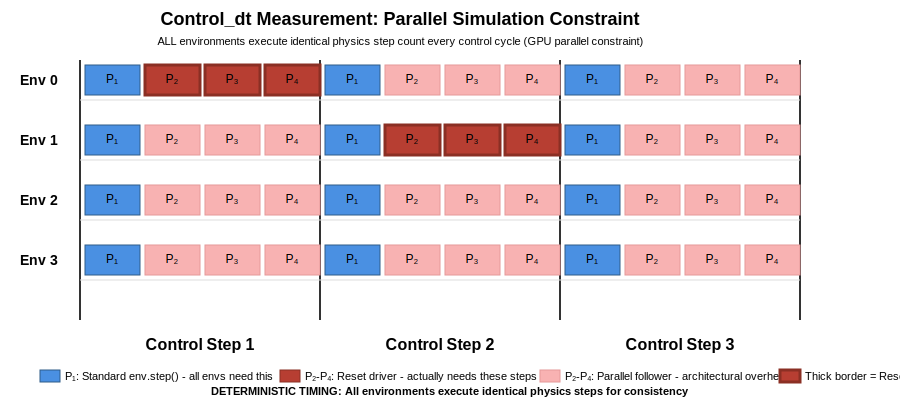

# Control_dt Timing Diagram: Understanding Parallel Simulation

This guide explains the control_dt measurement system and parallel simulation constraint that drives the DexHand environment's two-stage initialization architecture.

## The Problem: Why Timing Measurement is Essential

Traditional simulation assumes straightforward timing relationships:
- **Simple assumption**: `control_dt = physics_dt` (1:1 ratio)
- **Reality**: Environment resets require multiple physics steps for stabilization
- **GPU constraint**: ALL environments must step together, not individually

This creates a **timing consistency challenge**:
- Some control cycles involve environment resets (need extra physics steps)
- Other control cycles run normally (fewer physics steps needed)
- **Critical issue**: Variable timing breaks action scaling and policy assumptions

### Critical Architecture Requirement: Timing Consistency

The system must maintain absolutely consistent timing across all control cycles:
```python
# CORRECT - Every control cycle must execute identical physics steps
def control_cycle():
    # ALWAYS execute the measured number of physics steps
    for step in range(physics_steps_per_control_step):
        self.physics_manager.step_physics()
    # Never skip steps based on reset conditions
```

Any deviation from consistent timing corrupts the measurement system and breaks action scaling coefficients throughout the environment.

## The Solution: Parallel Simulation Constraint

Isaac Gym's GPU architecture requires **ALL environments to step together**:

### Core Architectural Constraint
- **Cannot step individual environments**: GPU parallel processing requirement
- **Must step all environments synchronously**: Hardware limitation, not design choice
- **Worst-case determines step count**: System measures maximum physics steps needed across all scenarios

### Visual Timeline



The timeline shows the fundamental insight: **every control step executes exactly the same number of physics steps**, determined by the worst-case reset scenario measured during initialization.

**Key Timeline Scenarios**:
- **Control Step 1**: Env 0 drives reset timing (needs actual reset logic)
- **Control Step 2**: Env 1 drives reset timing (different environment as reset driver)
- **Control Step 3**: No environments need reset, but **all still execute 4 physics steps**

**Critical Insight**: Even in Control Step 3 where no environment requires reset, the system maintains deterministic timing by executing all P₂-P₄ steps. This ensures every control cycle takes identical duration, preserving consistent action scaling and policy behavior.

### Physics Step Breakdown

During measurement, the system discovers that environment resets require 4 physics steps:

```
Physics Step Breakdown (Measured Example):
├── P₁: Standard env.step() call (always required)
├── P₂: Reset logic - moving hand to new position
├── P₃: Reset logic - placing/repositioning objects
└── P₄: Reset logic - final stabilization after setup

Result: ALL control steps use 4 physics steps forever
        control_dt = physics_dt × 4
```

## The Measurement Process

### 1. Initialization Measurement

The system performs active measurement during the first control cycle:

```python
# In DexHandBase._perform_control_cycle_measurement()
def _perform_control_cycle_measurement(self):
    # Start measurement
    self.physics_manager.start_control_cycle_measurement()

    # Process dummy actions and step physics
    dummy_actions = torch.zeros((self.num_envs, self.num_actions))
    self.action_processor.process_actions(dummy_actions)
    self.physics_manager.step_physics()

    # Force reset on all environments to measure worst-case scenario
    self.reset_idx(torch.arange(self.num_envs))  # Triggers maximum physics steps

    # Complete measurement and determine control_dt
    self.physics_manager.finish_control_cycle_measurement()
```

### 2. Deterministic Operation (Post-Measurement)

Once measured, the physics step count becomes **fixed and deterministic**:

- **Control Step 1**: [P₁|P₂|P₃|P₄] - 4 physics steps
- **Control Step 2**: [P₁|P₂|P₃|P₄] - 4 physics steps
- **Control Step 3**: [P₁|P₂|P₃|P₄] - 4 physics steps
- **Every subsequent step**: Exactly 4 physics steps, regardless of reset needs

### 3. Why No Conditional Logic

The system **never uses conditional logic** like:
```python
# WRONG APPROACH - Would break GPU parallel constraint
if any_env_needs_reset:
    take_4_physics_steps()
else:
    take_1_physics_step()  # IMPOSSIBLE on GPU!
```

Instead, **ALL environments always take the measured maximum** (4 physics steps), ensuring:
- Deterministic timing across all control cycles
- Consistent `control_dt` for action scaling
- GPU parallel processing compatibility

## Implementation Impact: Action Scaling

The measured `control_dt` is critical for position_delta control mode:

### Velocity-to-Delta Conversion
```python
# In ActionProcessor._compute_base_scaling_coeffs()
if self.action_control_mode == "position_delta":
    # Convert max velocity limits to max position deltas
    if i < 3:  # Linear DOFs
        max_delta = self.control_dt * self.policy_base_lin_velocity_limit
    else:  # Angular DOFs
        max_delta = self.control_dt * self.policy_base_ang_velocity_limit

    # Pre-compute scaling coefficients during finalize_setup()
    self.action_space_scale[action_idx] = 0.5 * (max_val - min_val)
```

### Why Measurement Timing Matters

If `control_dt` measurement is inconsistent:
- **Action scaling coefficients become wrong**: Policy actions get scaled incorrectly
- **Movement speeds become unpredictable**: Same action values produce different velocities
- **Training instability**: Inconsistent action→motion mapping breaks policy learning

## Architecture Benefits

### 1. Predictable Timing
Every control cycle takes exactly the same real-world time:
- **BaseTask** (physics_dt=0.005s): `control_dt = 0.020s` (4 × 0.005s)
- **BlindGrasping** (physics_dt=0.01s): `control_dt = 0.040s` (4 × 0.01s)

### 2. Reliable Action Scaling
Position_delta mode gets consistent velocity-to-position conversion:
- `max_delta = control_dt × max_velocity` always produces correct scaling
- Action coefficients computed once during finalization, never need updates

### 3. GPU Performance
All environments process in perfect parallel synchronization:
- No conditional branching in core simulation loop
- Maximum GPU utilization through lockstep execution

## Common Misconceptions

### ❌ "physics_steps_per_control_step is configurable"
**Truth**: It's measured during initialization based on actual reset complexity.

### ❌ "Physics steps vary per control cycle"
**Truth**: Every control cycle uses identical physics step count (deterministic post-measurement).

### ❌ "Individual environments can step independently"
**Truth**: GPU parallel constraint requires ALL environments step together.

### ❌ "Measurement can be skipped for performance"
**Truth**: Measurement is essential for correct action scaling and timing consistency.

## Related Documentation

### Technical Implementation
- **Component Initialization**: [`guide-component-initialization.md`](guide-component-initialization.md#two-stage-initialization-pattern) - Two-stage pattern and control_dt dependencies
- **Physics Implementation**: [`reference-physics-implementation.md`](reference-physics-implementation.md#physics-step-management) - Technical stepping details and auto-detection algorithm

### System Integration
- **Action Pipeline**: [`guide-action-pipeline.md`](guide-action-pipeline.md) - How control_dt affects action scaling and control modes
- **System Architecture**: [`ARCHITECTURE.md`](ARCHITECTURE.md) - Overall architectural principles and component relationships

### Troubleshooting
- **Environment Resets**: [`guide-environment-resets.md`](guide-environment-resets.md) - Reset logic and timing implications
- **Physics Tuning**: [`guide-physics-tuning.md`](guide-physics-tuning.md) - Physics parameter effects on measurement
