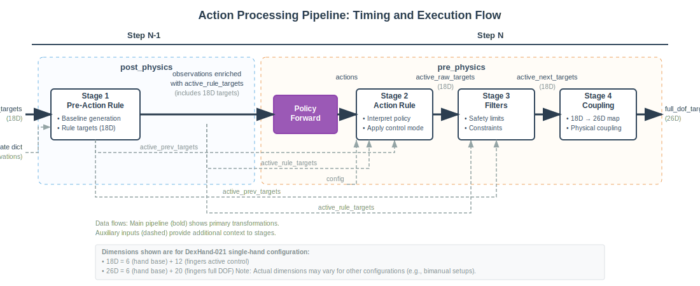

# Action Processing Pipeline Guide

This guide explains how DexRobot Isaac decomposes complex robotic control through a clean, extensible pipeline architecture.

**Related Documentation:**
- [DOF and Action Control API](reference-dof-control-api.md) - For DOF mappings and coupling details
- [Component Initialization](guide-component-initialization.md) - For two-stage initialization pattern
- [Physics Implementation](reference-physics-implementation.md) - For control_dt measurement
- [Observation System](guide-observation-system.md) - For observation-dependent rules

## The Control Decomposition Problem

Robotic control involves coordinating multiple concerns that traditionally get tangled together: baseline behaviors (like gravity compensation or trajectory following), policy decisions, safety constraints, and physical limitations. When these concerns are hardcoded together, systems become difficult to extend, modify, or debug. A grasping policy might need to work with demonstration baselines, residual learning corrections, confidence-based selective control, or entirely different baseline behaviors - but traditional approaches require rewriting control logic for each scenario.

## A Familiar Solution: Standard Control Modes

You're already familiar with the solution through DexRobot's `position` and `position_delta` control modes. These aren't separate control pathways - they're implementations of a 4-stage action processing pipeline that cleanly separates concerns:

When you use `position` control, the system:
1. **Pre-action**: Establishes baseline DOF targets (often previous targets or neutral poses)
2. **Action rule**: Scales your policy actions to DOF limits with velocity clamping
3. **Post-action**: Enforces safety constraints like position and velocity limits
4. **Coupling**: Maps the 18 policy-controlled DOFs to the full 26-DOF robot

Similarly, `position_delta` control uses the same pipeline structure but with a different action rule that adds scaled actions to previous targets rather than replacing them. This reveals the underlying elegance: standard control modes demonstrate good pipeline design with clear separation between baseline generation, policy application, constraint enforcement, and physical coupling.

The pipeline transforms policy actions through this functional sequence:
```
active_prev_targets → pre_action_rule → active_rule_targets → action_rule → active_raw_targets → post_action_filters → active_next_targets → coupling_rule → full_dof_targets
```

## Extending to Research Applications

This same pipeline structure naturally supports diverse research scenarios by allowing different components at each stage. The framework extends in two dimensions: variety of scenarios requiring different baseline behaviors, and variety of learning paradigms that interact with those baselines in different ways.

### Residual Learning from Demonstrations

Consider training a policy to improve upon expert demonstrations rather than learning from scratch. You have a dataset of successful grasping trajectories, and you want the policy to learn small corrections that handle variations the demonstrations didn't encounter.

The pipeline makes this natural: the pre-action rule provides demonstration targets as baselines, the action rule adds scaled policy corrections to those targets, and post-action filters ensure the modified targets remain safe. This cleanly separates the structured prior knowledge (demonstrations) from the learned corrections (policy output) while maintaining safety guarantees. The policy focuses on learning what corrections are needed rather than learning the entire task from scratch.

### Confidence-Based Selective Control

Now imagine a policy that's become confident about controlling finger movements but remains uncertain about hand positioning. You want confident control where the policy performs well, but safe fallback behaviors elsewhere.

The pipeline enables this through selective replacement: the pre-action rule computes safe baseline targets for all DOFs using a fallback controller, the action rule selectively overrides targets based on per-DOF confidence scores (if confidence[i] > threshold, use policy target[i], else keep fallback target[i]), and post-action filters validate the mixed result and revert problematic DOFs back to safe defaults. This creates robust mixed-initiative control where policies can gradually take over individual DOFs as they improve, with dual-layer safety through both confidence-based selection and sanity validation.

### Natural Problem Decomposition

Both scenarios demonstrate how the 4-stage separation creates natural problem decomposition. Complex research problems become tractable when properly separated into distinct concerns: baseline generation (pre-action), policy application (action rule), constraint enforcement (post-action), and physical coupling. Each stage serves a focused purpose, enabling composition of baseline behaviors, policy decisions, safety constraints, and physical relationships without tangling the logic together.

## Timing and Execution Flow

The 4-stage pipeline is implemented using a two-phase execution pattern that aligns with standard RL framework expectations and creates cleaner separation between observation preparation and action processing.

### The Timing Challenge

Traditional robotic control systems often bundle all action processing into a single pre-physics step. This creates timing misalignment with RL frameworks, which expect observations for step N to be available before step N begins. When baseline generation (Stage 1: Pre-Action Rule) depends on current observations, it must execute during observation computation rather than during action processing.

The core issue: pre-action rules need access to fresh state information to compute meaningful baselines (gravity compensation, trajectory following, etc.), but this computation must complete before the policy network runs. Bundling everything in pre_physics would mean computing observations twice or using stale data.

### Two-Phase Solution

The pipeline splits execution across two timing phases to resolve this dependency:

**post_physics (Step N-1):**
- Compute observations for the next step (Step N)
- Execute Stage 1 (Pre-Action Rule) using these fresh observations
- Generate `active_rule_targets` baseline for step N
- Complete observations by including the computed rule targets

**pre_physics (Step N):**
- Policy network forward pass using complete observations from Step N-1
- Execute Stage 2 (Action Rule) using:
  - `actions` from policy output
  - `active_rule_targets` from observations (computed in Step N-1)
  - `active_prev_targets` for continuity
- Execute Stage 3 (Post-Action Filters) to enforce constraints
- Execute Stage 4 (Coupling Rule) to map 18D active DOFs to 26D full robot
- Apply final targets to physics simulation



*Note: The dimensions shown in the diagram (18D and 26D) are specific to the DexHand-021 single-hand configuration. The pipeline architecture generalizes to other configurations - for example, bimanual setups or different hand models would have different dimensions but follow the same 4-stage processing structure.*

### Data Flow Through the Pipeline

Each stage transforms specific tensors through the pipeline:

1. **Stage 1 inputs**: `active_prev_targets` (18D) + state dict → outputs `active_rule_targets` (18D)
2. **Policy inputs**: observations with `active_rule_targets` → outputs `actions` (policy dimension)
3. **Stage 2 inputs**: `active_prev_targets`, `active_rule_targets`, `actions` → outputs `active_raw_targets` (18D)
4. **Stage 3 inputs**: `active_prev_targets`, `active_rule_targets`, `active_raw_targets` → outputs `active_next_targets` (18D)
5. **Stage 4 inputs**: `active_next_targets` (18D) → outputs `full_dof_targets` (26D)

Note that Stage 2 (Action Rule) receives multiple inputs because it needs to:
- Know the previous targets for delta-based control modes
- Access the baseline targets for selective override patterns
- Apply the policy's actions according to the control mode logic

The policy output can represent anything - absolute positions, deltas, forces, or abstract commands. The action rule determines how to interpret these values and update the DOF targets accordingly.

### RL Framework Alignment

This timing pattern matches standard RL rollout expectations:
- Observations for step N are fully computed in step N-1
- Policy receives complete observations at step N start
- Action processing occurs entirely within step N
- Clear temporal separation between observation prep and action execution

The two-phase approach ensures that baseline generation can access current state information while maintaining the clean action processing flow that policies expect. This architectural choice enables both reactive baseline behaviors (that respond to current conditions) and predictable action processing timing (that policies can rely on).

### Stage Mapping to Execution Phases

The 4-stage conceptual pipeline maps cleanly to the 2-phase execution:

- **Observation Phase (post_physics)**: Stage 1 executes alongside observation computation, providing rule targets that become part of the observation vector
- **Action Phase (pre_physics)**: Policy forward pass followed by Stages 2-4 executing sequentially, transforming policy output through interpretation, safety filtering, and physical coupling

This split respects the natural data dependencies while maintaining efficient execution. The observation phase prepares all information the policy needs, while the action phase handles all transformations from policy output to robot commands.

## Technical Implementation

The pipeline is implemented in `ActionProcessor` (`dexhand_env/components/action_processor.py`) through a series of functional transformations:

### Stage 1: Pre-Action Rule
- **Input**: `active_prev_targets` (18D: 6 base + 12 finger), state dict with observations
- **Output**: `active_rule_targets` (18D)
- **Purpose**: Generate baseline targets before policy actions are applied
- **Implementation**: `ActionProcessor.apply_pre_action_rule()`

```python
def gravity_compensation_rule(active_prev_targets, state):
    """Apply gravity compensation based on hand orientation."""
    env = state['env']
    obs_dict = state['obs_dict']

    targets = active_prev_targets.clone()

    # Use hand orientation from observations
    if 'hand_pose_quat' in obs_dict:
        hand_quat = obs_dict['hand_pose_quat']
        # Apply compensation logic...

    return targets

# Register the rule
env.action_processor.set_pre_action_rule(gravity_compensation_rule)
```

### Stage 2: Action Rule
- **Input**: `active_prev_targets`, `active_rule_targets`, policy `actions`, config dict
- **Output**: `active_raw_targets` (18D)
- **Purpose**: Apply policy actions according to control mode and masking
- **Implementation**: `ActionProcessor.apply_action_rule()`

The action rule is required and must be set explicitly. Built-in modes include:
- `position`: Scale actions to DOF limits with velocity clamping
- `position_delta`: Add scaled actions to previous targets

```python
def position_action_rule(active_prev_targets, active_rule_targets, actions, config):
    """Apply actions in position control mode."""
    # Start with rule targets to preserve uncontrolled DOFs
    targets = active_rule_targets.clone()

    # Get action processor reference
    ap = env.action_processor

    # Apply actions only to policy-controlled DOFs
    if config['policy_controls_base'] and config['policy_controls_fingers']:
        # Full control - scale actions to DOF limits
        scaled = ap._scale_actions_to_limits(actions)
        # Apply with velocity clamping...
    # Handle partial control cases...

    return targets

# Register the action rule (required!)
env.action_processor.set_action_rule(position_action_rule)
```

### Stage 3: Post-Action Filters
- **Input**: `active_prev_targets`, `active_rule_targets`, `active_raw_targets`
- **Output**: `active_next_targets` (18D)
- **Purpose**: Apply safety constraints and limits
- **Implementation**: `ActionProcessor.apply_post_action_filters()`

Built-in filters include:
- `velocity_clamp`: Limit maximum velocity between timesteps
- `position_clamp`: Clamp to DOF position limits

```python
def workspace_limit_filter(prev, rule, raw):
    """Limit hand position to workspace bounds."""
    filtered = raw.clone()
    # Apply workspace constraints to base DOFs...
    return filtered

# Register custom filter
env.action_processor.register_post_action_filter("workspace_limit", workspace_limit_filter)

# Enable via config:
# postActionFilters: ["velocity_clamp", "position_clamp", "workspace_limit"]
```

### Stage 4: Coupling Rule
- **Input**: `active_next_targets` (18D)
- **Output**: `full_dof_targets` (26D)
- **Purpose**: Map active DOFs to full DOF space with physical coupling
- **Implementation**: `ActionProcessor.apply_coupling_rule()`

### Two-Stage Observation Initialization

The system resolves a circular dependency between observations and pre-action rules through two-stage initialization:

1. **Partial Observations**: Compute all observations except `active_rule_targets`
2. **Complete Observations**: Apply pre-action rule, then add resulting targets to observations

```python
# Stage 1: Compute partial observations (exclude active_rule_targets)
obs_dict = self.observation_encoder.compute_observations(
    exclude_components=['active_rule_targets']
)

# Stage 2: Apply pre-action rule with partial observations
state = {'obs_dict': obs_dict, 'env': self}
active_rule_targets = self.action_processor.apply_pre_action_rule(
    self.action_processor.active_prev_targets, state
)

# Stage 3: Update observation with rule targets
obs_dict['active_rule_targets'] = active_rule_targets
self.obs_buf = self.observation_encoder.concatenate_observations(obs_dict)
```

### Configuration and Registry

Post-action filters use a registry pattern for extensibility:

```yaml
# Configuration
postActionFilters: ["velocity_clamp", "position_clamp"]
controlMode: "position"  # or "position_delta"
policyControlsHandBase: false
policyControlsFingers: true
```

Built-in filters are automatically registered, while custom filters can be added programmatically. Filter order matters - they're applied in the sequence listed in configuration.

### Pure Function Design

All rules use pure functions for composability:
- Input tensors are not modified
- Output is always a new tensor
- No hidden state changes
- Clear dimension consistency (18D active DOF → 26D full DOF)

This functional approach enables independent testing, clear data flow, and safe composition of different rule components within the pipeline architecture.
