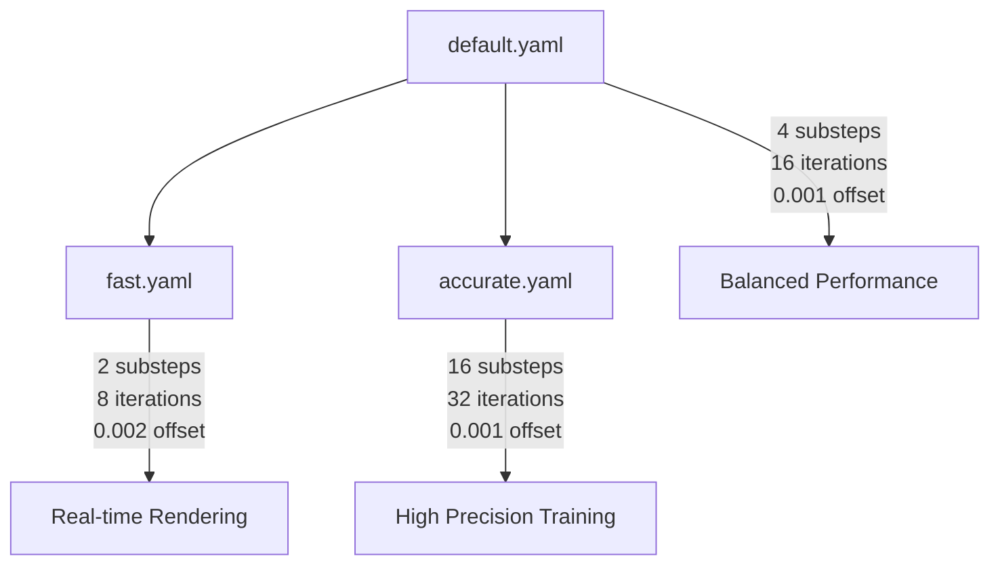

# Configuration System Guide

This guide explains the DexHand configuration system, including the 4-section hierarchy, modular physics configurations, and developer customization patterns.

**Related Documentation:**
- [System Architecture](ARCHITECTURE.md) - Overall system design principles
- [Physics Tuning Guide](guide-physics-tuning.md) - Detailed physics parameter reference
- [Training Guide](../TRAINING.md) - CLI usage and training workflows
- [Getting Started](GETTING_STARTED.md) - Quick setup and basic usage

## Overview

The DexHand configuration system is built on [Hydra](https://hydra.cc/) and uses a clean 4-section hierarchy to organize settings. This design provides:

- **Clear separation of concerns** between simulation, environment, task, and training
- **Modular physics configurations** for different performance/quality trade-offs
- **Inheritance and composition** for configuration reuse
- **CLI overrides** for quick experimentation
- **Type safety and validation** to catch configuration errors early

## Configuration Key Naming Conventions

The DexHand configuration system uses strategic naming conventions to balance CLI usability with Python code consistency:

### Casing Rules

**Task Section (`task:`)**
- **Uses snake_case** (e.g., `policy_controls_hand_base`, `reward_weights`)
- **Rationale**: Task keys are accessed primarily by Python code rather than CLI overrides
- **Benefits**: Consistent with Python naming conventions, reduces cognitive friction when working between config files and Python code

**Other Sections (`env:`, `sim:`, `train:`)**
- **Uses camelCase** (e.g., `numEnvs`, `episodeLength`, `maxIterations`)
- **Rationale**: These keys are frequently overridden via CLI for experimentation
- **Benefits**: Shorter CLI commands, follows established CLI conventions

### Examples

```yaml
# Task section - snake_case for Python consistency
task:
  policy_controls_hand_base: true
  max_finger_joint_velocity: 1.0
  reward_weights:
    object_height: 1.0
  contact_binary_threshold: 1.0

# Other sections - camelCase for CLI usability
env:
  numEnvs: 1024
  episodeLength: 300

sim:
  physicsEngine: "physx"

train:
  maxIterations: 10000
```

### CLI Override Impact

```bash
# Easy CLI overrides for frequently-used keys (camelCase)
python train.py numEnvs=2048 episodeLength=500

# Task keys less frequently overridden (snake_case when needed)
python train.py task.reward_weights.object_height=2.0
```

## 4-Section Configuration Hierarchy

The configuration system organizes all settings into four logical sections:

### `sim` - Physics Simulation
Controls the physics simulation engine and timing:

```yaml
sim:
  dt: 0.005                    # Control timestep (Hz = 1/dt)
  substeps: 4                  # Physics substeps per control step
  physics_engine: "physx"      # Physics engine (physx only supported)
  graphicsDeviceId: 0          # GPU device for rendering

  # PhysX solver parameters
  physx:
    solver_type: 1             # TGS solver (recommended)
    num_position_iterations: 16 # Position constraint iterations
    num_velocity_iterations: 0  # Velocity constraint iterations
    contact_offset: 0.001       # Contact detection distance
    rest_offset: 0.0005        # Contact penetration tolerance
    # ... additional PhysX parameters
```

**What belongs here:**
- Physics timestep and substeps
- PhysX solver configuration
- Contact and collision parameters
- Graphics device selection

### `env` - Environment Setup
Configures the simulation environment and world state:

```yaml
env:
  numEnvs: 1024               # Number of parallel environments
  device: "cuda:0"            # Computation device
  viewer: false               # Interactive visualization window
  envSpacing: 2.0             # Distance between environments

  # Task-specific environment objects
  box:
    size: 0.05                # Box dimensions (meters)
    mass: 0.1                 # Box mass (kg)
    friction: 1.0             # Surface friction coefficient
    initial_position:
      xy_range: 0.02          # Position randomization range
      z: 0.025                # Fixed height on table
```

**What belongs here:**
- Parallel environment configuration
- Task object properties (box, target objects)
- World setup and spacing
- Video recording/streaming settings

### `task` - RL Task Definition
Defines the reinforcement learning task parameters:

```yaml
task:
  name: "BlindGrasping"         # Task identifier
  episodeLength: 500          # Maximum episode steps
  controlMode: "position_delta" # Action control mode

  # Policy observations (what the agent sees)
  policyObservationKeys:
    - base_dof_pos
    - finger_dof_pos
    - contact_binary
    - hand_pose
    # ... other observation keys

  # Success/failure criteria
  termination:
    activeSuccessCriteria: ["grasp_lift_success"]
    activeFailureCriteria: ["hitting_ground", "box_too_far"]

  # Reward function weights
  rewardWeights:
    object_height: 1.0        # Reward for lifting object
    finger_contact: 0.5       # Reward for object contact
    # ... other reward components
```

**What belongs here:**
- Episode and task parameters
- Observation space configuration
- Reward function weights
- Success/failure criteria
- Task-specific behavioral parameters

### `train` - Training Algorithm
Configures the training algorithm and logging:

```yaml
train:
  seed: 42                    # Random seed
  test: false                 # Training vs test mode
  maxIterations: 10000        # Training iterations
  checkpoint: null            # Checkpoint path for loading

  # Logging configuration
  logging:
    logLevel: "info"          # Log verbosity
    logInterval: 10           # TensorBoard logging frequency
    rewardLogInterval: 10     # Reward logging frequency
    experimentName: null      # Auto-generated if null
```

**What belongs here:**
- Training algorithm parameters (handled by rl_games)
- Checkpoint loading/saving
- Logging and monitoring
- Experiment management settings

## Modular Physics Configuration System

The physics system uses inheritance to provide optimized configurations for different use cases:

### Configuration Files

```
dexhand_env/cfg/physics/
├── default.yaml      # Balanced quality/performance baseline
├── fast.yaml         # Optimized for real-time visualization
└── accurate.yaml     # Maximum precision for training
```

### Inheritance Hierarchy



### Physics Configuration Details

#### `default.yaml` - Balanced Baseline
```yaml
# @package sim
# Default physics configuration - balanced quality/performance
substeps: 4                     # Standard physics substeps
gravity: [0.0, 0.0, -9.81]
physx:
  solver_type: 1                # TGS solver
  num_position_iterations: 16   # Balanced precision
  contact_offset: 0.001         # High precision detection
  # ... other parameters
```

**Use cases:**
- BaseTask and general development
- Standard simulation accuracy requirements
- Balanced performance for most workflows

#### `fast.yaml` - Real-time Visualization
```yaml
# @package sim
# Fast physics for visualization - inherits from default
defaults: [default, _self_]

substeps: 2                     # Reduced substeps for speed
physx:
  num_position_iterations: 8    # Fewer iterations for speed
  contact_offset: 0.002         # Slightly relaxed precision
```

**Use cases:**
- `test_render.yaml` and `test_stream.yaml` configs
- Real-time visualization and debugging
- Interactive testing and development
- ~2-3x faster than default

#### `accurate.yaml` - High Precision Training
```yaml
# @package sim
# Accurate physics for training - inherits from default
defaults: [default, _self_]

substeps: 16                    # Many substeps for stability
physx:
  num_position_iterations: 32   # High iteration count
  # contact_offset inherited from default (0.001)
```

**Use cases:**
- BlindGrasping training for penetration mitigation
- Research requiring high physics fidelity
- Tasks with complex contact interactions
- ~2-3x slower than default but higher quality

### Selecting Physics Configurations

#### In Task Configurations
Override physics in task files:

```yaml
# Example: Custom task with high-precision physics
defaults:
  - BaseTask
  - /physics/accurate      # Use high-precision physics
  - _self_

# Task-specific timing override
sim:
  dt: 0.01                 # Task-specific 100Hz timing
```

#### In Test Configurations
Override physics for testing:

```yaml
# dexhand_env/cfg/test_render.yaml
defaults:
  - config
  - base/test
  - /physics/fast          # Fast physics for smooth rendering
  - _self_
```

## Developer Customization

### Configuration Override Patterns

#### 1. YAML File Overrides

**Creating Custom Task Configs:**
```yaml
# dexhand_env/cfg/task/MyCustomTask.yaml
# @package _global_
defaults:
  - BaseTask                 # Inherit base task settings
  - /physics/accurate        # Use high-precision physics
  - _self_                   # Apply overrides last

# Override specific sections
sim:
  dt: 0.008                  # Custom control frequency

env:
  numEnvs: 512              # Fewer envs for complex task

task:
  name: "MyCustomTask"
  episodeLength: 800        # Longer episodes

  # Custom reward weights
  rewardWeights:
    custom_reward: 2.0      # Task-specific reward
    object_height: 0.5      # Reduce base reward
```

**Creating Custom Physics Configs:**
```yaml
# dexhand_env/cfg/physics/ultra_fast.yaml
# @package sim
defaults: [fast, _self_]    # Inherit from fast.yaml

substeps: 1                 # Minimal substeps
physx:
  num_position_iterations: 4 # Minimal iterations
```

#### 2. CLI Argument Overrides

**Basic Override Patterns:**
```bash
# Override single values
python train.py env.numEnvs=2048
python train.py task.episodeLength=300
python train.py sim.dt=0.01

# Override nested values
python train.py task.rewardWeights.object_height=2.0
python train.py sim.physx.num_position_iterations=32

# Multiple overrides
python train.py task=BlindGrasping env.numEnvs=1024 sim.dt=0.005
```

**Using CLI Aliases:**
```bash
# Convenient aliases (see TRAINING.md for full list)
python train.py numEnvs=2048              # → env.numEnvs=2048
python train.py viewer=true               # → env.viewer=true
python train.py logLevel=debug            # → train.logging.logLevel=debug
```

**Physics Configuration Selection:**
```bash
# Select physics config via defaults override
python train.py +defaults=[config,/physics/fast]

# Or specify physics config with task explicitly
python train.py task=BlindGrasping +defaults=[config,/physics/accurate]
```

#### 3. Runtime Configuration Composition

**Combining Multiple Configs:**
```bash
# Use test base + custom physics + task override
python train.py -cn test_render task=BlindGrasping +physics=accurate
```

**Environment Variable Integration:**
```bash
# Use environment variables in configs
export CUDA_DEVICE=1
python train.py env.device="cuda:${oc.env:CUDA_DEVICE}"
```

### Common Configuration Scenarios

#### High-Performance Training
```bash
# Maximum environments with accurate physics
python train.py task=BlindGrasping numEnvs=4096 +defaults=[config,/physics/accurate]
```

#### Debugging with Visualization
```bash
# Few environments with fast physics and rendering
python train.py numEnvs=4 viewer=true physics=fast logLevel=debug
```

#### Custom Task Development
```yaml
# Create dexhand_env/cfg/task/MyTask.yaml
defaults: [BaseTask, /physics/default, _self_]
task:
  name: "MyTask"
  # ... custom parameters
```

#### Hyperparameter Sweeps
```bash
# Using Hydra multirun for parameter sweeps
python train.py -m task.rewardWeights.object_height=0.5,1.0,2.0 env.numEnvs=1024,2048
```

## Configuration Validation and Best Practices

### Validation System
The configuration system includes automatic validation:

```python
# Validation happens automatically in train.py
from dexhand_env.utils.config_validation import validate_config

if not validate_config(cfg):
    logger.error("Configuration validation failed")
    return
```

**Common Validation Checks:**
- Required fields are present and correct types
- Numeric values are within reasonable ranges
- Task-specific parameters are valid
- Physics parameters are compatible

### Best Practices

#### 1. Configuration Organization
- **Use inheritance** - Extend base configs rather than duplicating
- **Separate concerns** - Keep physics, task, and training settings distinct
- **Document overrides** - Comment why custom values are needed
- **Validate early** - Test configurations before long training runs

#### 2. Performance Optimization
- **Choose appropriate physics** - fast for debugging, accurate for training
- **Scale environments wisely** - More envs need more GPU memory
- **Monitor resource usage** - Use appropriate batch sizes and iteration counts

#### 3. Debugging Configuration Issues
```bash
# Check resolved configuration
python train.py --cfg job --resolve

# Validate configuration without training
python -c "
from dexhand_env.utils.config_validation import validate_config
from hydra import compose, initialize_config_dir
with initialize_config_dir(config_dir='dexhand_env/cfg'):
    cfg = compose(config_name='config', overrides=['task=BlindGrasping'])
    print('Valid:', validate_config(cfg))
"
```

#### 4. Version Control
- **Track config changes** - Commit configuration modifications
- **Document breaking changes** - Note when configs become incompatible
- **Use experiment tracking** - Save configurations with training runs

## Advanced Topics

### Custom Resolvers
You can add custom interpolation resolvers for dynamic configuration:

```python
# In your training script
from omegaconf import OmegaConf

# Register custom resolver
OmegaConf.register_new_resolver("custom", lambda x: f"custom_{x}")

# Use in config: ${custom:value} → "custom_value"
```

### Configuration Composition
Complex workflows can compose multiple configuration sources:

```yaml
# Advanced composition example
defaults:
  - base/multi_gpu           # Multi-GPU training base
  - task: BlindGrasping        # Task configuration
  - physics: accurate        # High-precision physics
  - train: distributed_ppo   # Distributed training algorithm
  - override /logging: wandb # W&B logging instead of TensorBoard
  - _self_                   # Apply local overrides
```

### Integration with Experiment Management
The configuration system integrates with experiment tracking:

```python
# Configuration is automatically saved with each training run
# Located at: runs/{experiment_name}/config.yaml
```

This ensures full reproducibility of training runs and makes it easy to compare different configuration variants.
